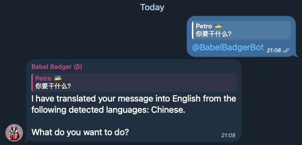

# BabelBadger: Telegram Translation Bot

## Description
This repository contains the source code for a translation bot on telegram called `@BabelBadgerBot`. The bot is designed to translate text into English using ChatGPT.

## Installation
This project uses the serverless framework. For more information about serverless and how to install it, visit their [website](https://www.serverless.com/).

## Ideas for future development
- Add support for translating into languages other than English (possibly based on the user's own language code)
- Allow users to specify or hint at the language of the text they are translating
- Allow for transliterated inputs

## License
This project is licensed under the [MIT License](LICENSE).

# TODO
* BUG: If you try to tag the bot for a message before it joined and the history is turned off, you get an erraneous response
